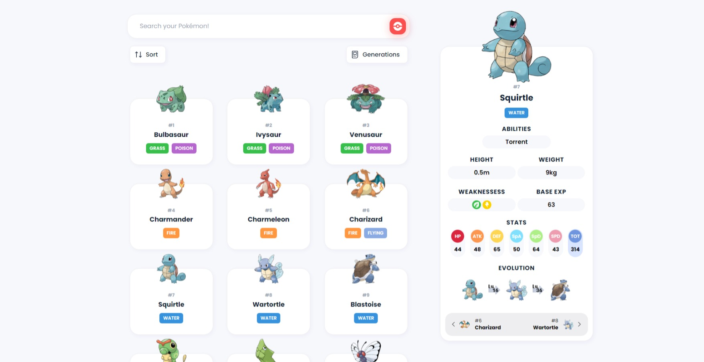
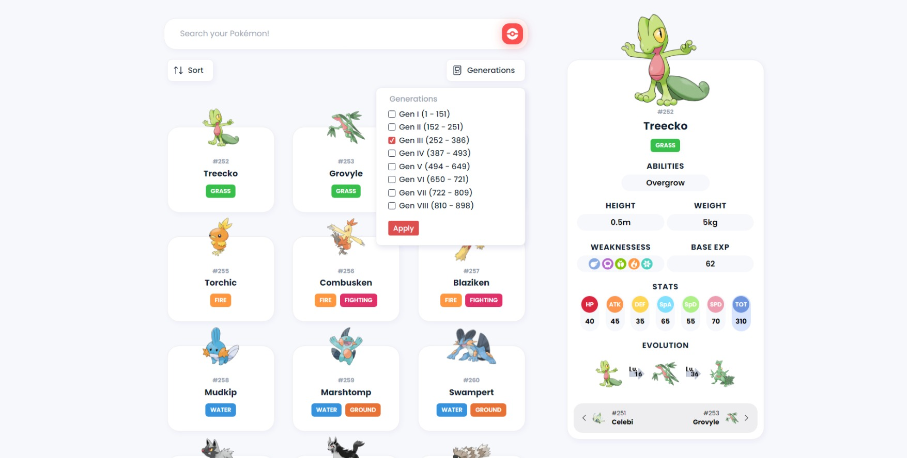
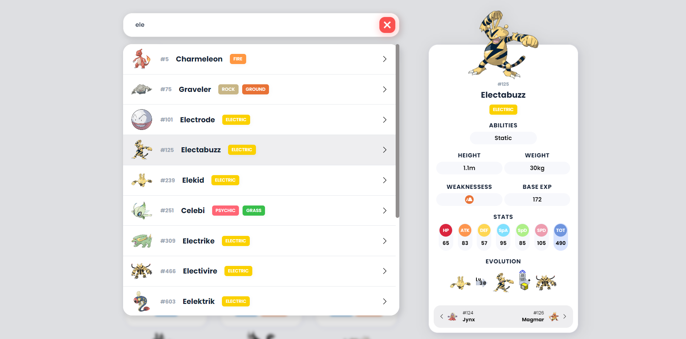
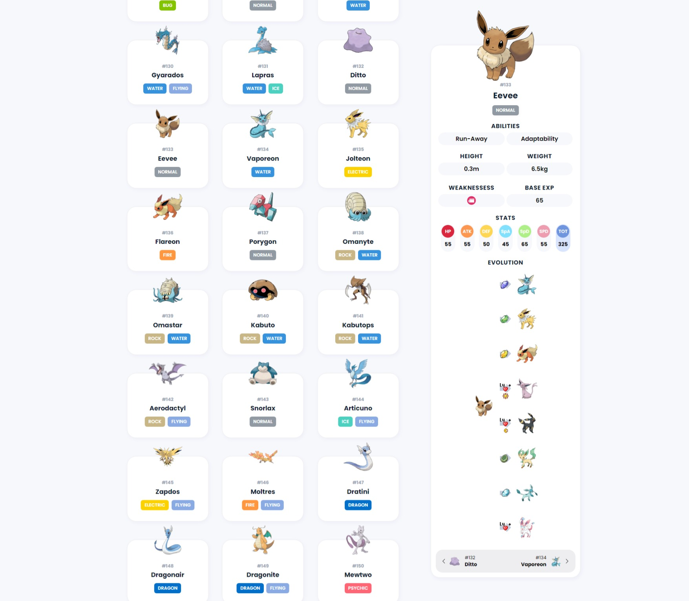

# Pokedex

This project is the first concrete product of my hard work with the Angular Framework. After learning a lot watching youtube videos and reading Angular documentation I've decided to build a Pokedex. 

## Table of contents

- [Overview](#overview)
  - [What I planned](#-what-i-planned)
  - [Screenshots](#-screenshots)
  - [Links](#-links)
- [My process](#my-process)
  - [Built with](#-built-with)
  - [What I learned](#-what-i-learned)
  - [Continued development](#-continued-development)
- [Author](#author)
- [Acknowledgments](#acknowledgments)

## Overview

### 🎯 What I planned

At the beginning, when I was planning the Pokedex I wanted to be able to put in practice the following concepts/features:

- Consuming the pokemon data from an API: the PokeAPI;
- Reproducing a design prototype developed by others;
- Using Angular Forms to show pokemon from different generations;
- Displaying all the pokemon using CSS Grid;
- Making a custom loading animation;
- Searching specific pokemon by name.

### 📸 Screenshots

First generation


Changing to the third generation using multiselect


Searching for pokemons using the search bar


Eevolutions ❤


### 🔗 Links

- Project repo: [Explore the Github Repository](vitorp4.github.io/pokedex)
- Live site: [View the live website](vitorp4.github.io/pokedex)
- Design inspiration: [Design on Behance](https://www.behance.net/gallery/113562309/Pokemon-Pokedex-Website-Redesign-Concept)
- PokeAPI: [See more about the PokeAPI](https://pokeapi.co/)

## My process

### 🔨 Built with

- Angular
- HTML
- CSS (SCSS)
- Javascript (Typescript)

### 🎓 What I learned

1. How to declare global color variables in `:root` and use then to customize components.

```css
:root {
  --normal-type-color: #919aa2;
  --fire-type-color: #ff9741;
  --water-type-color: #3692dc;
  --grass-type-color: #38bf4b;
  --electric-type-color: #fbd100;
  --ice-type-color: #4cd1c0;
}
```
```html
<div
  [style.backgroundColor]="'var(--' + pokemon.type + '-type-color)'"
  class="type-badge">
  {{ pokemon.type }}
</div>
```

2. How to use display grid to show the pokemon in a list of 3 columns.

```css
.poke-grid-container {
  display: grid;
  grid-template-columns: repeat(3, 1fr);
  row-gap: 40px;
  column-gap: 30px;
}
```
3. How to use `Promise.all()` to request many resources simultaneously

```js
Promise.all(
  pokemonNames.map(poke =>
    this.pokeApiService.getPokemonByName(poke.name).toPromise())
).then(pokemons => this.pokemons = pokemons)
```

4. How to use `OnChanges` to hear for changes of component input value.
```ts
ngOnChanges(changes: SimpleChanges) {
  if (changes.pokeId && changes.pokeId.currentValue !== undefined) {
    this.getPrevAndNextContent();
  }
}
```

5. How to use `ngForm` to allow user interaction with the content: by choosing the gens to display; or sorting pokemon by name or id, in an acending or descending way.
```html
<form (ngSubmit)="onSubmit(form)" #form="ngForm">
  <fieldset class="gen">
    <legend>Generations</legend>
    <ng-container *ngFor="let gen of gens; let i = index">
      <label>
        <input
          type="checkbox"
          [name]="gen.id"
          [value]="gen.id"
          [ngModel]="gen.id=='gen-i'"
        />{{ gen.label }} ({{ gen.range.from }} - {{ gen.range.to }})</label>
    </ng-container>
  </fieldset>
  <button type="submit">Apply</button>
</form>
```

7. How to use `@Input()`, `@Output`, `@ViewChild` and `@ViewChildren` to establish communication between components and access component's elements.
```ts
@ViewChild('form') form!: ElementRef<HTMLFormElement>;
@Output() formResult: EventEmitter<SortResult> = new EventEmitter<SortResult>();
```

### 🔮 Continued development

I still don't know how to develop a responsive interface for mobile. I've already heard about media query but I need time to learning about it. Maybe in the future I will return to improve this project. I feel this was a nice first step in my career building frontend websites. 

## Author
Find me on:

- Github - [@vitorp4](https://github.com/vitorp4)
- Frontend Mentor - [@vitorp4](https://www.frontendmentor.io/profile/vitorp4)
- CodePen - [@vitorp4](https://codepen.io/vitorp4)
- Medium - [@vitorp4](https://medium.com/@vitorp4)

## Acknowledgments

I'm so grateful to [Loiane Groiner](https://github.com/loiane) for publishing free videos about the Angular Framework on youtube. Thanks.
